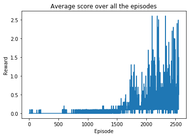
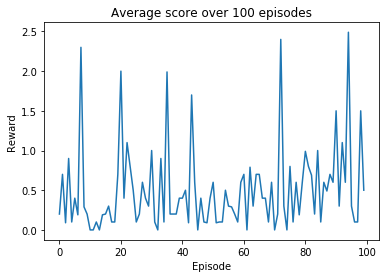

The algorithm i chose to solve this environment is Multi-Agent Deep Deterministic Policy Gradient (MADDPG), the multi-agent version of the DDPG.

In MADDPG, each agent has it's own actor and it's own critic. Agents share a common experience replay buffer which contains tuples 
with states and actions from all agents. 
Each agent does it's own sampling from this replay buffer. 
This allows agents to learn their own reward function and incorporate the actions of other agents in their learning. 
Therefore, we can train them in collaborative, competitive, or mixed environments. More details can be found in the MADDPG paper.

For this environment i created two separate DDPG agents. 
Actors take a 24 dimensional state input. 
Critics take a concatenation of the states (48 dimensions) and actions (4 dimensions) from both agents.

## Model

Actors are MLP with two hidden layers of 400 and 300 units and Relu activation. Actions are bounded from a Tanh activation
Critics are MLP with two hidden layers of 400 and 300 units and Relu activations. 
Actions signals is fed to the critic networks at the input layer!

## Hyperparameters
BUFFER_SIZE = int(4e4)  
BATCH_SIZE = 128       
GAMMA = 0.99            
TAU = 1e-3              
LR_ACTOR = 1e-4         
LR_CRITIC = 1e-3        
WEIGHT_DECAY = 0.0      
Update gradients every 2 steps vs every step.

## Tips

- L2 weight_decay of the critic set to 0.0 from 0.01 is a major improvement
- Actions are concatenated into the input layer 

## Results
The environment was solved in 2554 episodes, here you can check the reward plot over 100 episodes and the reward plot over the 2554 episodes :

-   

-  

## Ideas for Futrue Work
- Try to change the various hyperparameters and network architecture to see whether to get the agent to solve this environment faster.
- Implement Prioritized experience replay
- Implement different algorithms such as PPO or D4PG
- Try to train an agent with the soccer environment
