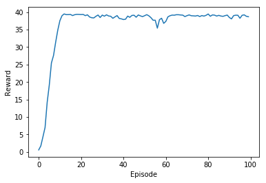

I chose to solve this environment with Deep Deterministic Policy Gradient (DDPG) since it works well with continuous action spaces.
It uses an actor-critic model, using value based methods to reduce the variance of policy based methods.

## Model
- Actor is a MLP with just 1 hidden layer of 256 units and Relu activation. Actions are bounded from a Tanh activation
- Critic is a 4 layers MLP (2 hidden layers) of 128-256-256 units with Leaky Relu activations. Action signal is fed to the critic network
at the second layer.

## Hyperparameters
Here the chosen hyperparameters for both single and multi agents environment:

BUFFER_SIZE = int(1e6)  
BATCH_SIZE = 128        
GAMMA = 0.99            
TAU = 1e-3              
LR_ACTOR = 1e-4          
LR_CRITIC = 3e-4        
WEIGHT_DECAY = 0.0001   

## Tips
Major improvements:
- I found that gradient clipping for critic's parameters only improves the performance in multi-agent training while in the single agent 
environment degraded it.
You can use *torch.nn.utils.clip_grad_norm(self.critic_local.parameters(), 1)* to clip the gradient.
- Parallelization seems to reduce the bias and improve stability during training.
- Using a normal distribution (np.random.randn) when adding randomness to the Ornstein-Uhlenbeck process. 

## Results
Here the [results](https://github.com/alessandropadrinofficial/Artificial_Intelligence/blob/master/Reinforcement_learning/Continuous_control/Training_20agents.txt) for the training session in the multi agents environment (using gradient clipping)

 

## Ideas for future work

- Add [noise to the policy parameters](https://blog.openai.com/better-exploration-with-parameter-noise/)
- Using [Distributed Distributional Deterministic Policy Gradients](https://arxiv.org/abs/1804.08617)
- Use prioritized experience replay. 
